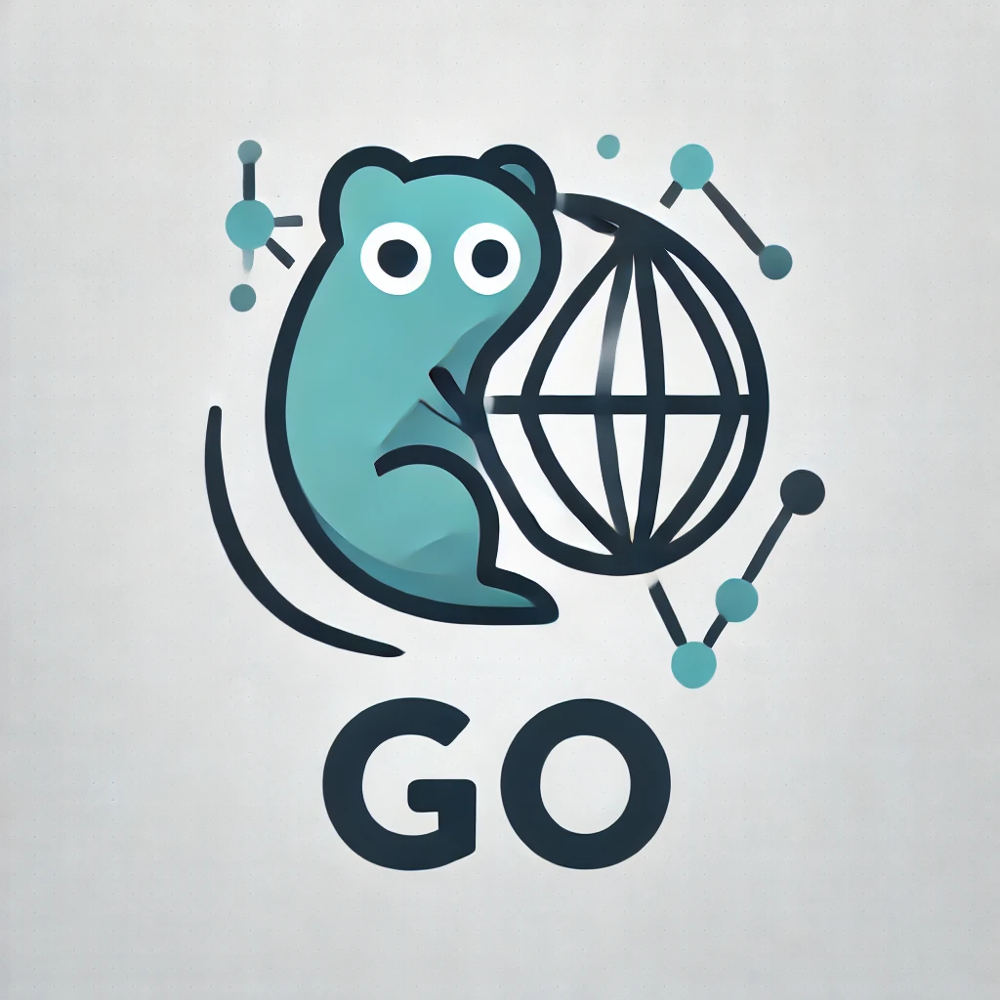

# githubtoplanguages
Generate your Top languages of Github

[](https://github.com/gouef/githubtoplanguages)

[](https://pkg.go.dev/github.com/gouef/githubtoplanguages)
[](https://github.com/gouef/githubtoplanguages/stargazers)
[](https://goreportcard.com/report/github.com/gouef/githubtoplanguages)
[](https://codecov.io/github/gouef/githubtoplanguages)

## Versions


## Introduction
Generate your Top languages of Github to `toplanguages.svg` (in root of repository). Next just copy raw link of svg and paste to your `Markdown`.

## Example


```markdown

```

### Action

```yaml
name: Create Top Languages

on:
  push:
  schedule:
    - cron: '0 */2 * * *'

jobs:
  build-and-run:
    runs-on: ubuntu-latest
    permissions:
      contents: write
    steps:
      - name: Run custom action
        uses: gouef/githubtoplanguages@main
        with:
          botName: "Jan Galek"
          botEmail: "ghome.cz@gmail.com"
          user: "JanGalek"
          limit: 6
          ignoredOrgsFlag: "wowmua"
          ignoredReposFlag: "wowmua/Maps"
          ignoredLangsFlag: ""
          withForks: "false"
          withStreak: "true"
          showStats: "true"
          statsFeatures: "commits,prs,reviews,issues,stars,repos,followers"
        env:
          GITHUB_TOKEN: ${{ secrets.USER_GITHUB_TOKEN }}
```

## Action inputs

| Input              | Default              | Required | Description                                                                                               |
|--------------------|----------------------|----------|-----------------------------------------------------------------------------------------------------------|
| `botName`          | `Jan Galek`          | `false`  | Set bot name for contributors                                                                             |
| `botEmail`         | `ghome.cz@gmail.com` | `false`  | Set bot email address for contributors                                                                    |
| `user`             | ``                   | `true`   | Github UserName                                                                                           |
| `limit`            | `8`                  | `true`   | Limit of languages                                                                                        |
| `ignoredOrgsFlag`  | ``                   | `true`   | Comma-separated list of ignored organizations                                                             |
| `ignoredReposFlag` | ``                   | `true`   | Comma-separated list of ignored repositories                                                              |
| `ignoredLangsFlag` | ``                   | `false`  | Comma-separated list of ignored languages                                                                 |
| `withForks`        | `false`              | `false`  | Include forked repositories in the analysis (true/false)                                                  |
| `withStreak`       | `true`               | `false`  | Include streak statistics of your github (true/false)                                                     |
| `showStats`        | `true`               | `false`  | Include statistics of your github account (true/false)                                                    |
| `statsFeatures`    | ``                   | `false`  | Comma-separated list of statistics features to include (commits,prs,reviews,issues,stars,repos,followers) |


## GitHub Personal Access Token (PAT) Scopes

To successfully analyze repositories, organizations, forks, and Pull Requests, your GitHub Personal Access Token (stored in your repository secrets, e.g., `USER_GITHUB_TOKEN`) must have specific permissions enabled.

Depending on the type of token you choose to generate, configure the following scopes:

### 1. Tokens (classic) — *Recommended for simplicity*
When creating a classic token via *Settings -> Developer settings -> Personal access tokens -> Tokens (classic)*, check the following boxes:

* **`repo`** (Full control of private and public repositories)
  * *Why:* Crucial for reading your personal code, tracking down fork configurations, and fetching deeply nested Pull Request files.
* **`read:org`** (Under the `admin:org` section)
  * *Why:* Absolutely required for the organization module to function. Without this scope, the GitHub GraphQL API will securely hide your organizations and return `0` results.

---

### 2. Fine-grained tokens — *Recommended for enhanced security*
If you prefer restricting the token's lifetime and scoping it down to specific target accounts, go to *Tokens (fine-grained)* and configure:

#### **Repository permissions**
* **Contents:** `Read-only` *(To evaluate source files and calculate total code bytes)*
* **Metadata:** `Read-only` *(Mandatory for fetching repository definitions and standard properties)*
* **Pull Requests:** `Read-only` *(To inspect line additions and structures inside your PR history)*

#### **Organization permissions**
* **Members:** `Read-only` *(To discover which organization jupiters you are a member of)*
* **Metadata:** `Read-only` *(To access corporate repositories and public schemas)*

#### **Account permissions:**
* **Unassigned user data / Profile:** `Read-only` *(Required to fetch the user contribution calendar and calculate streaks)*

---

### ⚠️ Crucial Step for SAML Single Sign-On (SSO)
If any of your organizations (such as private company groups or specific open-source communities like EpicGames) enforce **SAML SSO**, your token will be blocked by default until you manually authorize it.

1. Go to your GitHub **Personal Access Tokens** settings page.
2. Find your generated token and click the **Configure SSO** button right next to it.
3. Locate your organization in the list and click **Authorize**.

*Failure to complete this manual authorization step will cause the API to hide those organizations completely, resulting in empty metrics.*

## Contributing

Read [Contributing](CONTRIBUTING.md)

## Contributors

<div>
<span>
  <a href="https://github.com/JanGalek"></a>
</span>
<span>
  <a href="https://github.com/actions-user"></a>
</span>
<span>
  <a href="https://github.com/choseogyeong"></a>
</span>
</div>

## Join our Discord Community! 🎉

[](https://discord.gg/wjGqeWFnqK)

Click above to join our community on Discord!
